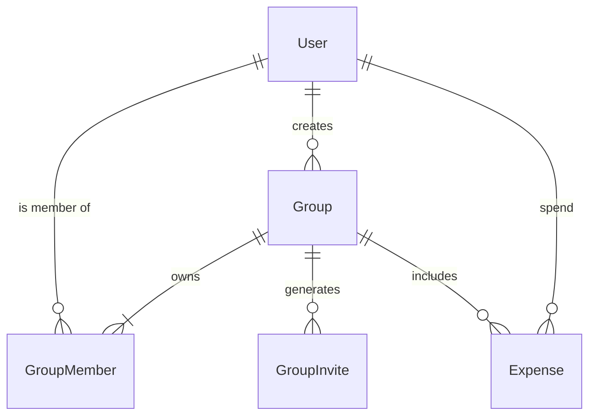

```ts
/**
 * "Carlo" needs to send 5 euros to "Pietro", Buffi should know about users
 */
interface User {
  id: string
  name: string
  email: string
}

/**
 * The core object of the app.
 */
interface Expense {
  id: string
  title: string
  amount: number
}

/**
 * Every expense is grouped
 */
interface Group {
  id: string
  name: string
  
}
```

