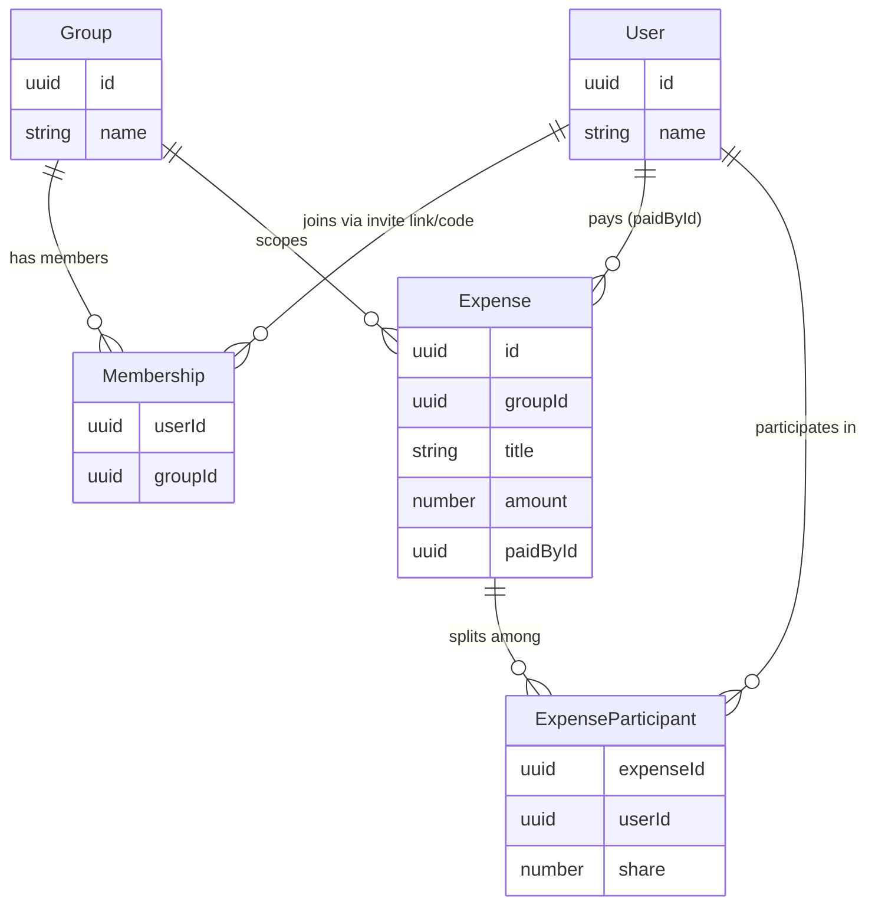

```mermaid
erDiagram
  User {
    uuid id
    string name
  }
  Group {
    uuid id
    string name
  }
  Membership {
    uuid userId
    uuid groupId
  }
  Expense {
    uuid id
    uuid groupId
    string title
    number amount
    uuid paidById
  }
  ExpenseParticipant {
    uuid expenseId
    uuid userId
    number share
  }

  User ||--o{ Membership : "joins via invite link/code"
  Group ||--o{ Membership : "has members"
  Group ||--o{ Expense : "scopes"
  User ||--o{ Expense : "pays (paidById)"
  Expense ||--o{ ExpenseParticipant : "splits among"
  User ||--o{ ExpenseParticipant : "participates in"
```

## Glossary

- **User** — a distinct real person. Auth/login mechanics are not yet decided (deferred).
- **Group** — a fixed, persistent circle of `User`s (e.g. "housemates", "Japan trip"). A Group is a sync domain boundary: every `Expense` belongs to exactly one Group, and a `User` can belong to multiple Groups at once, each syncing independently.
- **Membership** — the many-to-many relationship between `User` and `Group`. Created when a `User` opens a Group's shareable invite link/code.
- **Expense** — belongs to exactly one `Group` (`groupId`), has one payer (`paidById`), and splits among its `ExpenseParticipant`s.
- **ExpenseParticipant** — one `User`'s share of an `Expense`. `share` is currently always equal across an Expense's participants (e.g. all `1`); the field exists so weighted/custom splits can be introduced later without a schema migration.
